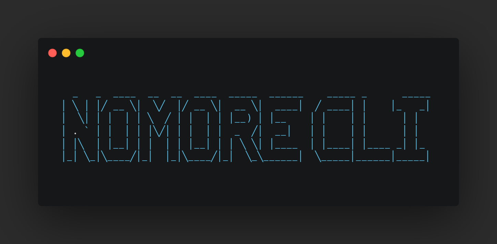

  

  <h2 align="center">NOMORE CLI</h2>

  

    A command-line interpreter for NOMORE — a custom esoteric programming language inspired by Brainfuck.
     
    <a href="https://github.com/haidarbahzi/NOMORE">View on GitHub</a>
    &middot;
    <a href="https://github.com/haidarbahzi/NOMORE/issues/new?labels=bug&template=bug-report---.md">Report Bug</a>
    &middot;
    <a href="https://github.com/haidarbahzi/NOMORE/issues/new?labels=enhancement&template=feature-request---.md">Request Feature</a>
  

---

## 📖 About The Project

**NOMORE CLI** is a command-line tool to run `.nomore` files — source code written in the NOMORE esolang.  
This language is heavily inspired by Brainfuck, focusing on minimalist syntax and raw memory manipulation.

### Features:
- Minimal and fast interpreter
- Clean command-line interface
- Supports `.nomore` files
- Custom error messages and help prompts